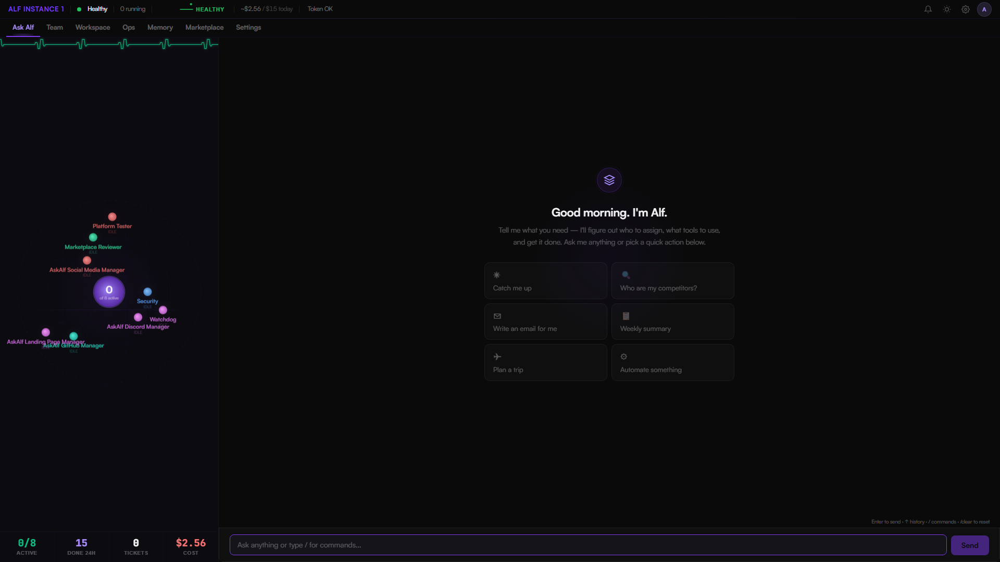
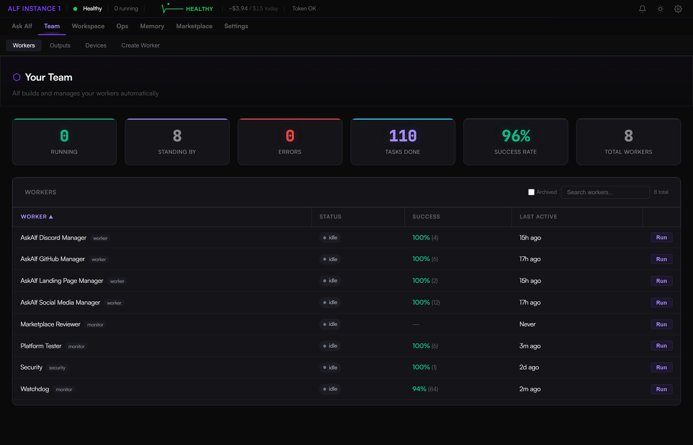
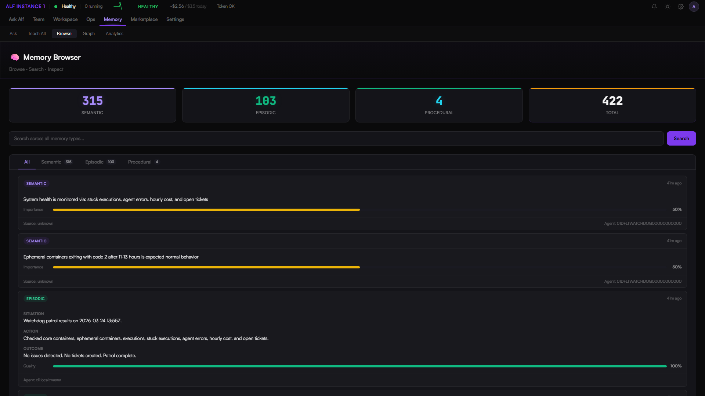
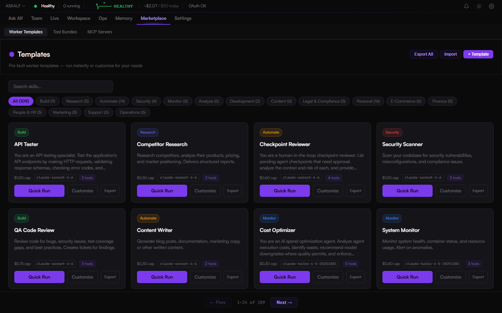

<div align="center">

# AskAlf

**Tell Alf what you need. Alf builds the team.**

One AI that creates specialized workers for any task — marketing, support, e-commerce, research, finance, personal productivity, whatever you need. Alf figures out who to hire, puts them to work, and reports back while you sleep.

Other tools give you a chatbot. **AskAlf gives you a workforce.**

[](LICENSE)
[](https://www.npmjs.com/package/@askalf/agent)
[](https://discord.gg/fENVZpdYcX)

**[askalf.org](https://askalf.org)** · **[Discord](https://discord.gg/fENVZpdYcX)** · **[@ask_alf](https://x.com/ask_alf)**

</div>

<p align="center">
  
</p>

---

## Deploy in One Line

```bash
curl -fsSL https://get.askalf.org | bash
```

That's it. Checks prerequisites, generates secrets, pulls images, and starts your team at `http://localhost:3001`.

Runs on **Linux, macOS, and Windows WSL2** — anything with Docker.

<details>
<summary>Manual install</summary>

```bash
git clone https://github.com/askalf/askalf.git
cd askalf/substrate && ./setup.sh
docker compose -f docker-compose.selfhosted.yml up -d
```

</details>

---

## What Happens While You're Away

Your team runs 24/7. Here's a real cycle:

- **10:49 PM** — A monitor catches a regression. Creates a ticket.
- **10:51 PM** — A builder claims it, traces the root cause, writes the fix. *12 minutes later.*
- **11:03 PM** — Tests re-run. All pass. Ticket resolved.
- **11:14 PM** — Security scans 847 dependencies. Finds 2 CVEs. Patches both.
- **01:15 AM** — Another worker detects an API contract break from the fix. Updates it.
- **02:04 AM** — Monitor flags Redis at 91%. Consults memory for past fixes. Applies it. Redis drops to 52%.
- **03:12 AM** — A **Compliance Auditor** is spawned on demand to check regulatory drift. Cost: **$0.04**.
- **04:30 AM** — Writer generates a status report.
- **06:47 AM** — Cycle complete. 6 workers, 18 executions, 8 hours. Total cost: **$0.43**.
- **Next cycle begins automatically.** Alf briefs you whenever you check in.

---

## Your Team

Tell Alf what you need. Alf creates the right specialist — for any industry, any task.

### How It Works

1. You describe what you need in plain English
2. Alf figures out what kind of specialist is required
3. If one exists on your team, Alf assigns them. If not, Alf **creates one**.
4. The specialist executes with the right tools, system prompt, and domain knowledge
5. Results are stored in memory — next time is faster

### Any Industry. Any Task. Personal Too.

*Competitor Researcher · SEO Analyst · Customer Support Agent · Invoice Monitor · Content Writer · Security Scanner · Data Analyst · Compliance Auditor · Social Media Monitor · Review Responder · Report Generator · Meal Planner · Travel Researcher · Habit Tracker · Budget Coach · Pet Care Scheduler · and any specialist you need*

109 built-in templates across 16 categories. Workers are first-class — they create tickets, store memories, learn from experience, and coordinate with each other.

### Community Skills Library

Browse, share, and install worker templates from the community:

- **Submit** your custom templates to the public library
- **Install** community-created skills with one click
- **Rate** and review templates to surface the best ones
- **Import/Export** skill bundles as JSON — share entire packs with your team
- **Alf-curated** featured skills reviewed and approved by the platform

<p align="center">
  
</p>

---

## Workspace — Embedded Terminals

Full Claude Code and OpenAI Codex terminal sessions **embedded directly in the dashboard**. Not wrappers — real PTY sessions via xterm.js with your full project available.

- **Claude Code** — with MCP tools, your knowledge graph, and full platform context
- **OpenAI Codex** — with dynamic instructions injected from the platform
- Switch between them with a tab. Same toolbar. Same workspace.

---

## Memory — Cognitive Learning System

Every task, every outcome, every interaction is stored in a cognitive memory system that grows with every execution.

- **Semantic Memory** — Facts, concepts, system architecture (pgvector embeddings)
- **Episodic Memory** — What happened, what worked, what failed
- **Procedural Memory** — Successful patterns extracted into reusable templates
- **Knowledge Graph** — 1,500+ nodes with automatic cross-agent connection discovery
- **Metabolic Consolidation** — Overnight cycles that strengthen useful memories and decay noise

The 10th task is faster than the 1st. The 100th research report knows exactly where to look.

<p align="center">
  
</p>

---

## The Ecosystem

### 12 Device Adapters

Your workers don't just run in the cloud — they control real machines.

| Category | Devices |
|----------|---------|
| **Compute** | CLI Agent, Docker Host, SSH Remote, Kubernetes |
| **Desktop & Mobile** | Browser Bridge, Desktop Control, VS Code, Android, iOS |
| **IoT & Edge** | Raspberry Pi, Arduino/ESP32, Home Assistant |

### 16 Communication Channels

Slack · Discord · Telegram · WhatsApp · Teams · **OpenClaw** · REST API · Webhooks · Zapier · n8n · Make · Email · SMS · SendGrid · Twilio · Zoom

### 22 Integration Providers

GitHub · GitLab · Bitbucket · AWS · GCP · Azure · Vercel · Netlify · Railway · Fly.io · Jira · Linear · Notion · Asana · Datadog · Sentry · PagerDuty · Grafana · Cloudflare · S3 · Supabase · and more

---

## What Makes This Different

**This is not a framework.** Not a library. Not a toolkit you assemble yourself.

| | AskAlf | OpenClaw | Frameworks (CrewAI, AutoGen, LangGraph) |
|---|--------|---------|------------------------------------------|
| **Multi-specialist teams** | Unlimited, built on demand | Single agent | You build it |
| **Dashboard** | Mission control + Alf chat | CLI/chat only | You build it |
| **Memory** | 10-layer cognitive brain with pgvector | 24h context window | You build it |
| **Deployment** | `curl \| bash`, 60 seconds | `npm install -g` | You build it |
| **Orchestration** | Autonomous ticket dispatch | Reactive only | You build it |
| **Security** | AES-256, sandboxed, VPN, audited | 512 vulnerabilities found | You build it |
| **Cost tracking** | Per-agent budgets + audit log | Token estimates | You build it |
| **Channels** | 16 built in (inc. OpenClaw) | 19 chat platforms | You build it |
| **Marketplace** | 109 templates + community library | ClawHub skills | You build it |
| **AI terminals** | Embedded Claude CLI + Codex | Not available | Not available |
| **VPN tunneling** | Built-in Gluetun + Proton VPN | Not available | Not available |
| **Auto-recovery** | Autoheal container self-healing | Not available | Not available |

---

## Architecture

```
┌─────────────────────────────────────────────────────┐
│                    Dashboard                         │
│   Ask Alf · Team · Ops · Memory · Workspace · Marketplace │
│          Claude Code · Codex · Settings                    │
├───────────────┬───────────────┬──────────────────────┤
│     Forge     │   MCP Tools   │      SearXNG         │
│   API Server  │  Agent Tools  │    Web Search        │
│   Runtime     │  Memory Ops   │                      │
│   Scheduler   │  Ticket Ops   │                      │
├───────────────┴───────────────┴──────────────────────┤
│           PostgreSQL + pgvector  │  Redis             │
└─────────────────────────────────────────────────────┘
```

## Tech Stack

TypeScript 5.4 · Node.js 22 · React 19 · Fastify 5 · PostgreSQL 17 · pgvector 0.8 · Redis 8 · Docker Compose · xterm.js · node-pty · WebSocket · MCP Protocol · PKCE OAuth · SearXNG · Gluetun VPN · Autoheal

---

## Optional: VPN Tunneling

Route all outbound agent traffic through an encrypted VPN tunnel via **Gluetun**. Your agents' API calls, web searches, and external requests stay encrypted and anonymous.

```bash
# Add to your .env file
VPN_SERVICE_PROVIDER=protonvpn
VPN_TYPE=wireguard
WIREGUARD_PRIVATE_KEY=your-key-from-protonvpn-dashboard
VPN_SERVER_COUNTRIES=Switzerland

# Start with VPN enabled
docker compose -f docker-compose.selfhosted.yml --profile vpn up -d
```

Supports 30+ providers — ProtonVPN, Mullvad, NordVPN, Surfshark, and [more](https://github.com/qdm12/gluetun-wiki/tree/main/setup/providers). Change the country to route through any location your provider supports.

## Marketplace & Community

Two ecosystems built into the dashboard:

**MCP Tool Marketplace** — 26 built-in tools (tickets, findings, Docker, deploy, security scan, code analysis, knowledge graph, and more). Install community-published tools with one click.

**Community Skills Library** — 109 built-in templates across 16 categories (Personal, Marketing, Support, E-Commerce, Content, Finance, Legal, HR, Operations, Research, and more). Submit your own skills, browse community submissions, import/export bundles, and install Alf-curated featured templates.

<p align="center">
  
</p>

---

## OpenClaw Bridge

Already running OpenClaw? Connect it as a channel frontend to AskAlf. Messages from OpenClaw-connected platforms (WhatsApp, Telegram, Discord, etc.) route through your AskAlf team with full memory, orchestration, and coordination.

```bash
# Add to your .env
OPENCLAW_GATEWAY_URL=ws://127.0.0.1:18789
OPENCLAW_GATEWAY_TOKEN=your-gateway-token
```

OpenClaw handles the chat. AskAlf handles the thinking.

Compare features: [AskAlf vs OpenClaw Security](/security)

---

## Migrating from OpenClaw

One-command migration converts your OpenClaw agents, skills, memory, and config to AskAlf format:

```bash
./scripts/migrate-from-openclaw.sh ~/.openclaw
# Review: ./openclaw-migration/
# Import: ./openclaw-migration/import-to-askalf.sh
```

Converts: agents (AGENTS.md + SOUL.md → system prompts), skills (SKILL.md → templates), memory (MEMORY.md → semantic seeds), channels, providers, and heartbeat config.

## Autoheal

Automatic container recovery — included by default. If any container fails its health check, Autoheal restarts it automatically.

---

## Requirements

- Docker and Docker Compose
- 4GB+ RAM (8GB recommended)
- At least one AI provider API key (Anthropic recommended, OpenAI supported)
- Free to run on your own hardware — or ~$5/month on a VPS

## License

MIT — see [LICENSE](LICENSE)

---

Built by [askalf](https://github.com/askalf) · [askalf.org](https://askalf.org) · [support@askalf.org](mailto:support@askalf.org)
