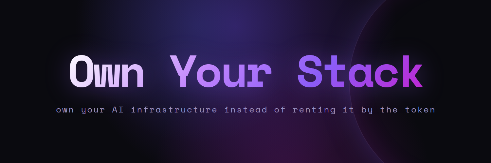

# Own Your Stack

**Own your AI infrastructure instead of renting it by the token.** One subscription. Your box. Your terms.

You were sold a meter — intelligence rented by the token, your data through someone else's pipes, your tools on someone else's roadmap and someone else's pricing meeting. I'm building the opposite: a stack you actually *own*. The open tools are the door; a real autonomous studio running in production is the proof — the unfinished parts included.

## The stack

| | | |
|---|---|---|
| **[dario](https://github.com/askalf/dario)** | **own your routing** — your Claude subscription in any tool (Cursor, Cline, Aider, the Agent SDK), at subscription pricing, not per-token bills |  |
| **[deepdive](https://github.com/askalf/deepdive)** | **own your research** — a local agent that plans, searches, reads, and synthesizes a cited answer, through your own router |  |
| **[hands](https://github.com/askalf/hands)** | **own your computer-use** — your LLM on your own mouse, keyboard, and screen, with an audit log of everything it does |  |
| **[agent](https://github.com/askalf/agent)** | **own your fleet** — connect any device, run the shell or Claude Code tasks the fleet dispatches |  |
| **[browser-bridge](https://github.com/askalf/browser-bridge)** | **own your browser** — stealth headless Chromium in a container, CDP on your own endpoint |  |
| **[claude-sync](https://github.com/askalf/claude-sync)** | **own your sessions** — move Claude Code sessions across machines, byte-identical |  |
| **[askalf](https://askalf.org)** | **own your operation** — the self-hosted AI workforce platform the whole stack runs | early access |

More of the stack → **[sprayberrylabs.com/own-your-stack](https://sprayberrylabs.com/own-your-stack)**

## Building it in the open

It's hard, and it's not finished — that's the point. The value isn't a demo; it's the scars from running agents in production for real. I write down what actually happens.

I'm **Thomas Sprayberry** — 20 years of engineering, from solo founders to Fortune 500. I run **[Sprayberry Labs](https://sprayberrylabs.com)**, a studio of one that moves at a team's pace because the workforce above does the heavy lifting while I architect, review, and own everything that ships.

---

**[Own Your Stack](https://sprayberrylabs.com/own-your-stack)** · **[sprayberrylabs.com](https://sprayberrylabs.com)** · **[@ask_alf](https://x.com/ask_alf)** · **hello@sprayberrylabs.com**
