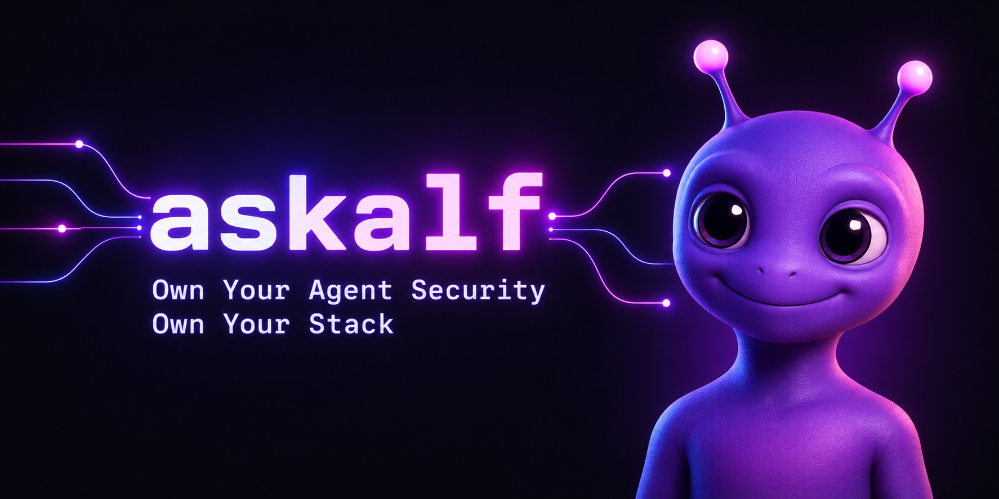
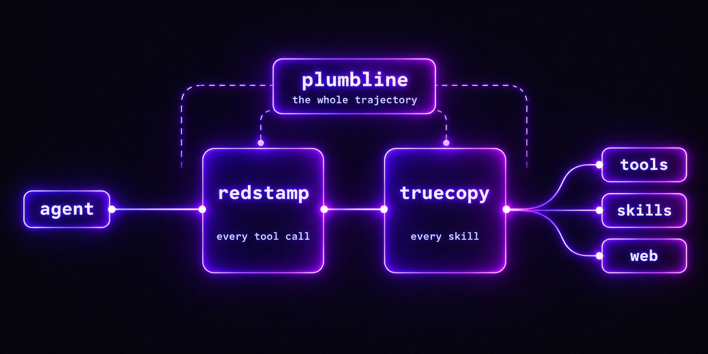
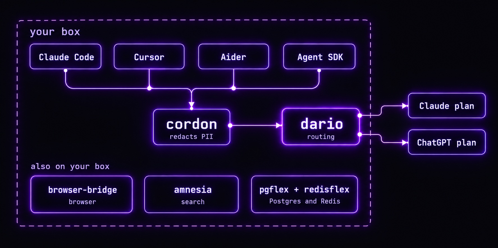
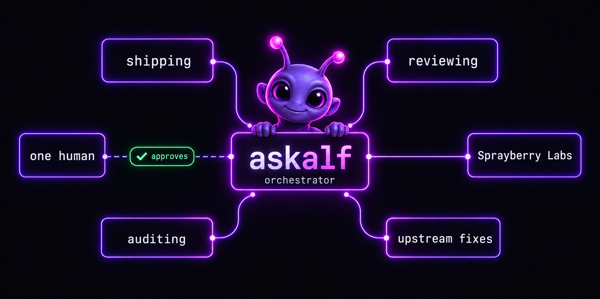

**Two questions, two answers.** What are your agents *allowed to do*? And what do they *run on*?

[Own Your Agent Security](#own-your-agent-security) · [Own Your Stack](#own-your-stack) · [The operation](#the-operation) · [Receipts](#receipts) · [Who](#thomas-sprayberry)

---

Agents are useful because they act. That is also the whole risk: a tool call that runs a shell, a skill fetched from a marketplace, a browser session on a hostile page. **Own Your Agent Security** is the answer to the first question: deterministic gates around what an agent may do, running in production here. **Own Your Stack** is the answer to the second: the subscription you already pay for, on your own box, routed and guarded by tools you can read in a weekend, instead of intelligence rented by the token through someone else's pipes.

Everything below is open source, and everything below runs the operation that ships it.

## Own Your Agent Security

**Don't trust agents by default.** A firewall for every tool call, a supply-chain gate for every skill and MCP server, and a trajectory monitor watching the whole sequence. Each closes a different hole; together they are one layered defense.

| | own your… | what it does | |
|---|---|---|---|
| **[redstamp](https://github.com/askalf/redstamp)** | **agent security** | A deterministic, offline firewall for agent tool calls. Blocks RCE, secret exfiltration, SSRF, prompt injection and poisoned MCP tools, with a tamper-evident audit trail. Governs CrewAI, LangGraph, the OpenAI Agents SDK and AutoGen with runnable [examples](https://github.com/askalf/redstamp/tree/master/examples). |   |
| **[truecopy](https://github.com/askalf/truecopy)** | **agent skills** | Vet, sign and pin every skill and MCP server before it runs, then fail the build when the bytes change. 68,560 skills audited across two ecosystems, with a daily watch on the official Claude Code plugin directory. [truecopy-action](https://github.com/askalf/truecopy-action) runs the same gate in CI. |    |
| **[plumbline](https://github.com/askalf/plumbline)** | **agent trajectory** | Out-of-band, read-only monitoring that scores an agent's *whole action sequence* against its declared job. Catches an escape assembled from individually authorized steps that every per-call gate waves through. |   |
| **[agent-security-stack](https://github.com/askalf/agent-security-stack)** | **the composition** | redstamp and truecopy behind one governed MCP server, with [strongroom](https://github.com/askalf/strongroom) leases so an agent holds a scoped, single-use credential and never the raw key. Vet the tool, contain the call. |  |

The agentic-browser half, [fieldpass](https://github.com/askalf/fieldpass), moved into [browser-bridge](https://github.com/askalf/browser-bridge) on 2026-09-06 as its `policy/` layer: an indirect-prompt-injection firewall and action gate between the agent and the open web, living in the runtime it governs.

## Own Your Stack

**One subscription. Your box. Your terms.** You were sold a meter. These are the pieces that make the plan you already pay for, and the machine you already own, do the work.

| | own your… | what it does | |
|---|---|---|---|
| **[dario](https://github.com/askalf/dario)** | **routing** | One local endpoint that puts your Claude and ChatGPT subscriptions behind Cursor, Cline, Aider, Claude Code, Codex CLI and the Agent SDK. Either plan answers either wire shape, with failover between them, session-sticky multi-seat pooling, and hourly drift watchers that track Claude Code's request shape. Zero runtime dependencies. |      |
| **[cordon](https://github.com/askalf/cordon)** | **prompts** | A PII-redacting LLM gateway that fails closed: strip or reversibly tokenize names, emails and secrets before a prompt leaves your perimeter. Ships as an attested container. |   |
| **[browser-bridge](https://github.com/askalf/browser-bridge)** | **browser** | Stealth headless Chromium in a container, Chrome DevTools Protocol on your own endpoint, with the fieldpass policy layer in front of it. |   |
| **[amnesia](https://github.com/askalf/amnesia)** | **search** | Search the web, remember nothing. Privacy meta-search with no accounts, no ads and no query log, live at [amnesia.tax](https://amnesia.tax). |   |
| **[hybrid](https://github.com/askalf/hybrid)** | **inference** | Local-first LLM routing: answer the easy majority on a small local model and escalate only the queries that earn a frontier call. Dependency-free Python, built and measured on a GPU-less 2013 desktop; the numbers are in its README. |  |
| **[pgflex](https://github.com/askalf/pgflex)** · **[redisflex](https://github.com/askalf/redisflex)** | **foundation** | One Postgres API and one Redis API, each with two modes: the real server in production, an in-process engine (PGlite, or a Map plus EventEmitter) for standalone and tests. The trick that lets a whole platform run without Docker. |   |

The whole map, one page → **[ownyourstack.sprayberrylabs.com](https://ownyourstack.sprayberrylabs.com)**

## The operation

**[askalf](https://askalf.org)** is the autonomous AI operation that runs [Sprayberry Labs](https://sprayberrylabs.com): an orchestrator and twenty-plus specialist agents shipping, reviewing, auditing and invoicing, with one human approving what matters. It is not a product. The register is public: the roster, the minutes, the figures.

It runs on the tools above, which is the point of listing them. dario routes the fleet's model traffic across pooled seats. redstamp gates its tool calls, including the ones this profile was written with. truecopy verifies every skill at load. plumbline has been run over its real session traffic. And every pull request in these repos gets an automated gating review from a different model family than the one that wrote the code, posted in the open, before a human merges it.

## Receipts

Every claim on this page traces to a merged PR, a release, a public badge or a measured incident.

- **dario** has shipped **531 releases since April 2026**, each SLSA-attested and published to npm from CI with no long-lived token. It holds a 9.4 [OpenSSF Scorecard](https://scorecard.dev/viewer/?uri=github.com/askalf/dario) and a 100% [Best Practices](https://www.bestpractices.dev/projects/13638) badge, and it saw 27,000+ npm installs in the last 30 days (both figures as of 2026-09-07; the badges above are live).
- **Four repos at 100% OpenSSF Best Practices:** [dario](https://www.bestpractices.dev/projects/13638), [truecopy](https://www.bestpractices.dev/projects/14488), [redstamp](https://www.bestpractices.dev/projects/14489), [amnesia](https://www.bestpractices.dev/projects/14490).
- **Upstream, merged by the maintainers:** a Windows deep-path download crash fix in [huggingface_hub #4546](https://github.com/huggingface/huggingface_hub/pull/4546), the client library the Hugging Face stack is built on; a corrected patched-version range in [github/advisory-database #8824](https://github.com/github/advisory-database/pull/8824); truecopy listed under Security in [awesome-mcp-servers #10332](https://github.com/punkpeye/awesome-mcp-servers/pull/10332).

Write-ups, each with the numbers and the misses:

- **[We scanned the marketplace that started the poisoned-skills panic](https://sprayberrylabs.com/blog/the-marketplace-that-started-the-panic)**: all 66,541 ClawHub skills poison-scanned with truecopy. Zero confirmed malicious, 813 deterministic alarms, every one checked and mapped.
- **[The leaderboard I refused to build](https://sprayberrylabs.com/blog/the-leaderboard-i-refused-to-build)**: why an agent-firewall leaderboard is a category error, and a threat-model map instead, with redstamp's own numbers shown, misses included.
- **[Auditing the skills supply chain](https://sprayberrylabs.com/blog/auditing-the-skills-supply-chain)**: truecopy across 2,019 published Claude skills. What a real marketplace audit finds, and doesn't.
- **[Zero raw credentials](https://sprayberrylabs.com/blog/keeper-zero-raw-credentials)**: migrating a live agent fleet from 132 inherited environment keys to strongroom leases, one seam at a time.
- **[An injection firewall for the agentic browser](https://sprayberrylabs.com/blog/picket-governed-agentic-browser)**: why the lethal trifecta is structural, and how fieldpass gates it.
- **[A self-healing release pipeline](https://sprayberrylabs.com/blog/dario-self-healing-release-pipeline)**: how dario ships, health-gates and rolls itself back.
- **[Own your inference](https://sprayberrylabs.com/blog/own-your-inference)**: the measurements behind hybrid.
- **redstamp governing third-party frameworks:** [CrewAI](https://sprayberrylabs.com/blog/crewai-flowdef-under-askalf) · [LangGraph](https://sprayberrylabs.com/blog/langgraph-under-askalf) · [OpenAI Agents SDK](https://sprayberrylabs.com/blog/openai-agents-under-askalf) · [AutoGen](https://sprayberrylabs.com/blog/autogen-under-askalf).

Full engineering log → **[sprayberrylabs.com/blog](https://sprayberrylabs.com/blog)**

## Thomas Sprayberry

I'm the one human. Fifteen-plus years in systems and infrastructure engineering, data centers and virtualization, before the agent work. I run **[Sprayberry Labs](https://sprayberrylabs.com)**, the software studio with one person on staff: askalf ships the code, reviews the pull requests, verifies the findings and watches production, and I architect, review and sign everything that leaves the shop. It's hard and it isn't finished. I write down what actually happens.

Portfolio → **[thomas.sprayberrylabs.com](https://thomas.sprayberrylabs.com)**

---

**[Own Your Stack](https://ownyourstack.sprayberrylabs.com)** · **[Own Your Agent Security](https://github.com/askalf/agent-security-stack)** · **[the operation](https://askalf.org)** · **[sprayberrylabs.com](https://sprayberrylabs.com)** · **[@ask_alf](https://x.com/ask_alf)** · **hello@sprayberrylabs.com**

