

### I build the infrastructure AI agents run on, and I run it in production.

**[dario](https://github.com/askalf/dario)** · 544★ · 27,000+ npm installs a month · 600 releases 
**14 fixes merged upstream** into Node.js, Hugging Face, Erigon, GitHub, Raycast, Taro, Lingui, gosec, Sprayberry Archive and more

[Portfolio](https://thomas.sprayberrylabs.com) · [Engineering log](https://sprayberrylabs.com/blog) · [What I build](#what-i-build) · hello@sprayberrylabs.com

---

## dario

<a href="https://github.com/askalf/dario">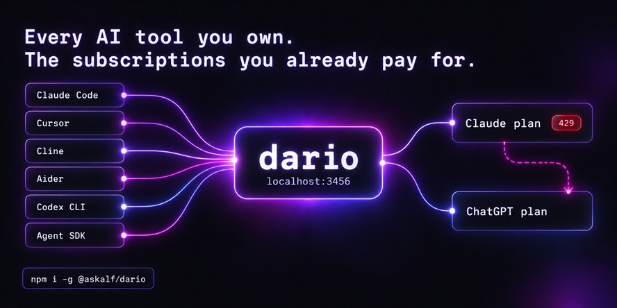</a>

**One local endpoint that puts your Claude and ChatGPT subscriptions behind any coding tool.** Cursor, Cline, Aider, Claude Code, Codex CLI and the Agent SDK all talk to it. Either plan answers either wire shape, with failover between them, session-sticky multi-seat pooling, one key per developer with a daily budget, and eleven unattended watchers that track Claude Code's request shape. Zero runtime dependencies.

Every release is SLSA-attested and published from CI with no long-lived token. 9.4 OpenSSF Scorecard, 100% Best Practices.

    

## Merged upstream

Fixes found, reproduced and landed in other people's projects, reviewed and merged by their maintainers.

| Project | The fix |
|---|---|
| [nodejs/undici #5827](https://github.com/nodejs/undici/pull/5827) | The WebSocket parser kept a message's compressed flag after it completed, so a stray continuation frame was accepted instead of failing the connection. |
| [huggingface_hub #4546](https://github.com/huggingface/huggingface_hub/pull/4546) · [#4896](https://github.com/huggingface/huggingface_hub/pull/4896) | Two Windows long-path bugs in the client the Hugging Face stack is built on: a crash downloading into a deep directory, and a tree cache that silently switched itself off. |
| [erigontech/erigon #24022](https://github.com/erigontech/erigon/pull/24022) | A consensus-layer TTL cache now expires on read instead of running a sweep goroutine, and a peer-refresh loop no longer outlives its owner's context. |
| [github/advisory-database #8824](https://github.com/github/advisory-database/pull/8824) | A security advisory's patched-version range that missed the 1.x fix. |
| [securego/gosec #1746](https://github.com/securego/gosec/pull/1746) | An always-out-of-range index that the G602 analyzer waved through under an equality guard. |
| [raycast/extensions #31314](https://github.com/raycast/extensions/pull/31314) | A scoreboard command sent a date range the ESPN endpoint rejects with a 400; it now asks one day at a time. |
| [qax-os/excelize #2402](https://github.com/qax-os/excelize/pull/2402) | Conditional-formatting and data-validation ranges moved onto the wrong row when their first row was deleted. |
| [getopenscreen/openscreen #708](https://github.com/getopenscreen/openscreen/pull/708) | Linux capture lost an early first frame; the capture-started state is now latched. |
| [silverbulletmd/silverbullet #2128](https://github.com/silverbulletmd/silverbullet/pull/2128) | Short or link-leading task lines never got the page reference their Linked Mentions toggle needs. |
| [williamngan/pts #228](https://github.com/williamngan/pts/pull/228) | A numeric equality threshold excluded a difference exactly at the threshold, unlike the point comparison beside it. |
| [NervJS/taro #19506](https://github.com/NervJS/taro/pull/19506) | `Events#once` could fire twice when its callback re-triggered the event, and stayed attached when the callback threw; a one-shot listener now fires exactly once and detaches on every path. |
| [lingui/js-lingui #2677](https://github.com/lingui/js-lingui/pull/2677) | A new catalog message was written with `translation` first and rewritten with it last on the next extract, a diff that changed nothing; new messages now use the merge path's key order. |
| [sprayberry-archive/agent-security-stack #26](https://github.com/sprayberry-archive/agent-security-stack/pull/26) | The security stack update was merged upstream. |
| [awesome-mcp-servers #10332](https://github.com/punkpeye/awesome-mcp-servers/pull/10332) | truecopy listed under Security. |

## What I build

Two questions every agent deployment has to answer: what is it *allowed to do*, and what does it *run on*? Everything here is open source, and runs the operation that ships it.

### Own Your Agent Security

Deterministic gates around what an agent may do.

<table>
<tr>
<td width="50%" valign="top"><a href="https://github.com/askalf/redstamp">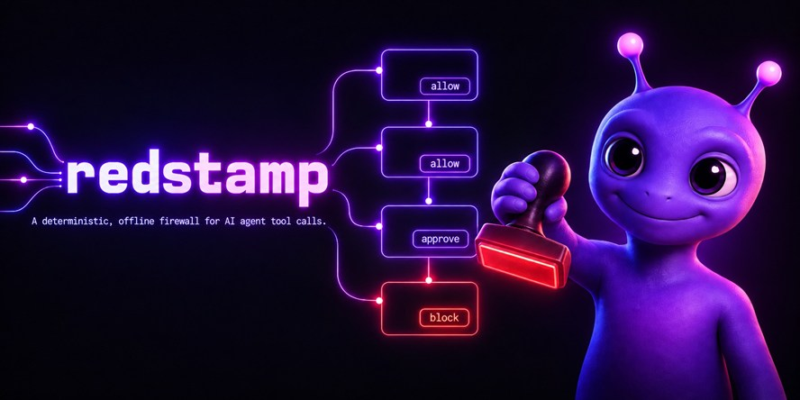</a> <b><a href="https://github.com/askalf/redstamp">redstamp</a></b>: an offline firewall for agent tool calls. It blocks RCE, secret exfiltration, SSRF, prompt injection and poisoned MCP tools, with a tamper-evident audit trail, under CrewAI, LangGraph, the OpenAI Agents SDK and AutoGen.</td>
<td width="50%" valign="top"><a href="https://github.com/askalf/truecopy">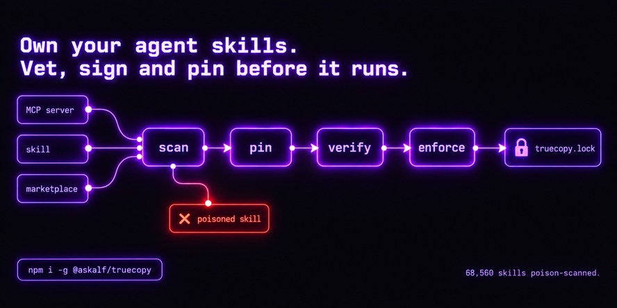</a> <b><a href="https://github.com/askalf/truecopy">truecopy</a></b>: vet, sign and pin every skill and MCP server, then fail the build when the bytes change. 68,560 skills poison-scanned across two ecosystems.</td>
</tr>
<tr>
<td width="50%" valign="top"><a href="https://github.com/askalf/truecopy-action">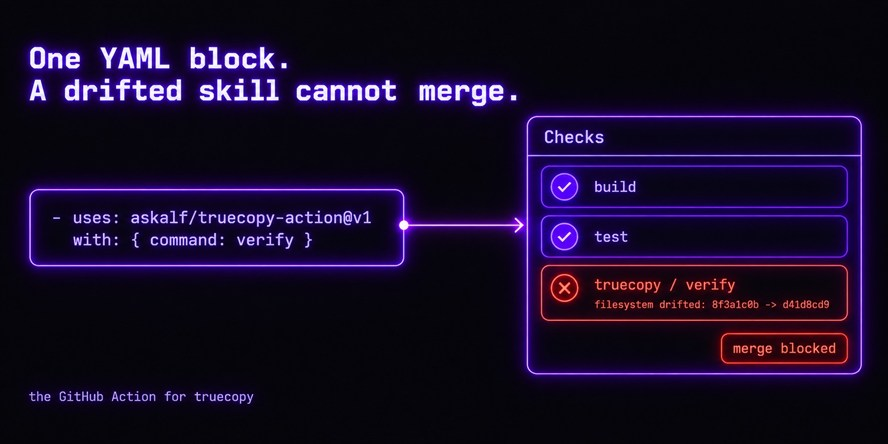</a> <b><a href="https://github.com/askalf/truecopy-action">truecopy-action</a></b>: truecopy as a GitHub Action. One YAML block, and a skill that drifted or turned poisonous fails the pull request.</td>
<td width="50%" valign="top"><a href="https://github.com/askalf/plumbline">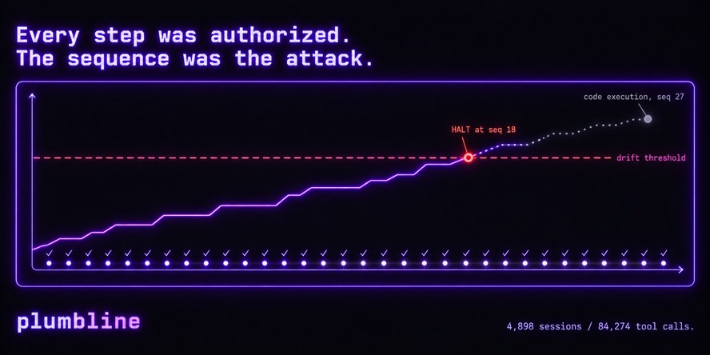</a> <b><a href="https://github.com/askalf/plumbline">plumbline</a></b>: out-of-band monitoring that scores an agent's <i>whole action sequence</i> against its declared job, catching an escape assembled from individually allowed steps.</td>
</tr>
</table>

### Own Your Stack

The plan you already pay for, on the machine you already own.

<table>
<tr>
<td width="50%" valign="top"><a href="https://github.com/askalf/cordon">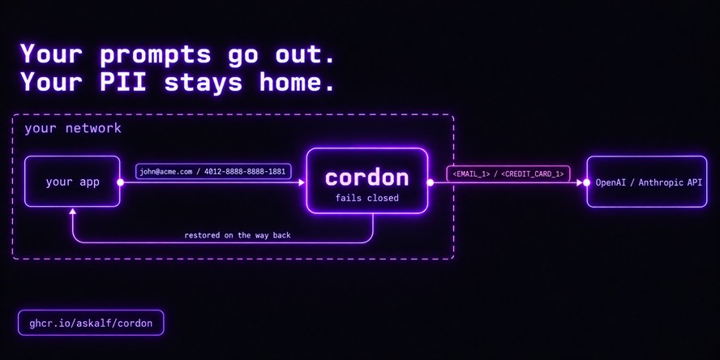</a> <b><a href="https://github.com/askalf/cordon">cordon</a></b>: a PII-redacting LLM gateway that fails closed, shipped as an attested container. Put it in front of dario and the emails, phone numbers, card numbers, keys and other patterns it detects are replaced before a shared subscription sees them; names and free text are outside its coverage.</td>
<td width="50%" valign="top"><a href="https://github.com/askalf/browser-bridge">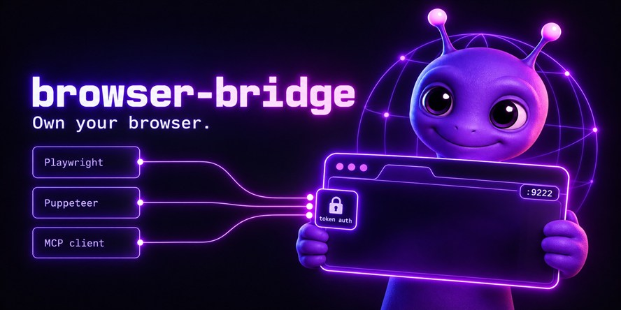</a> <b><a href="https://github.com/askalf/browser-bridge">browser-bridge</a></b>: stealth headless Chromium on your own CDP endpoint, with token auth and a prompt-injection firewall in front of it.</td>
</tr>
<tr>
<td width="50%" valign="top"><a href="https://github.com/askalf/amnesia">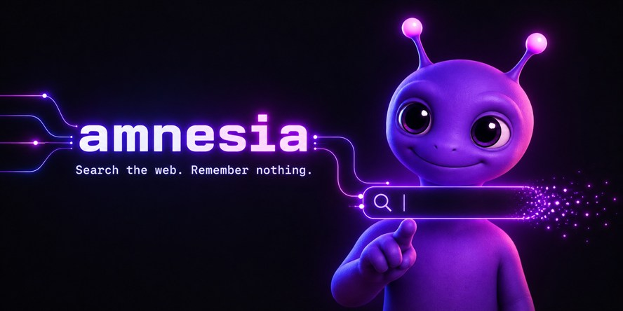</a> <b><a href="https://github.com/askalf/amnesia">amnesia</a></b>: privacy meta-search with no accounts, no ads and no query log, live at <a href="https://amnesia.tax">amnesia.tax</a>.</td>
<td width="50%" valign="top"><a href="https://github.com/askalf/pgflex">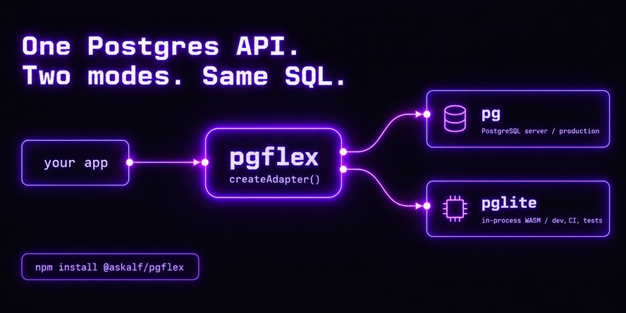</a> <b><a href="https://github.com/askalf/pgflex">pgflex</a></b>: one Postgres API, two modes. A real server in production, in-process PGlite for dev, CI and tests, same SQL.</td>
</tr>
<tr>
<td width="50%" valign="top"><a href="https://github.com/askalf/redisflex">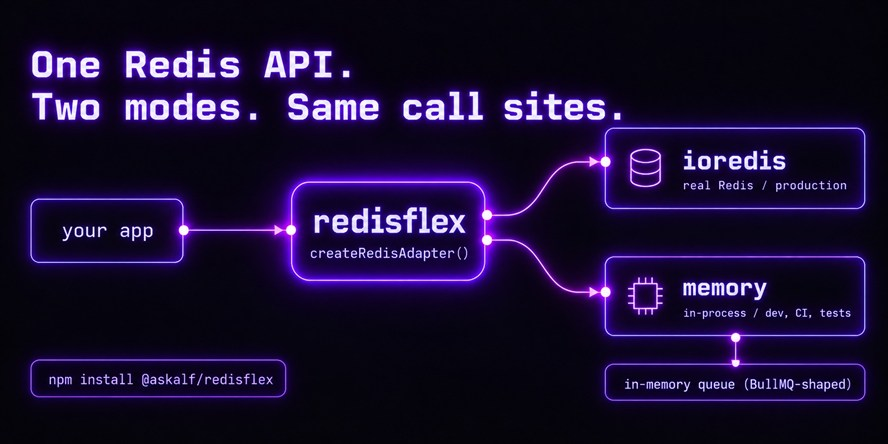</a> <b><a href="https://github.com/askalf/redisflex">redisflex</a></b>: one Redis API, two modes, plus a BullMQ-shaped in-memory queue, so a whole platform runs without Docker.</td>
<td width="50%" valign="top"><a href="https://github.com/askalf/checkout-with-retry">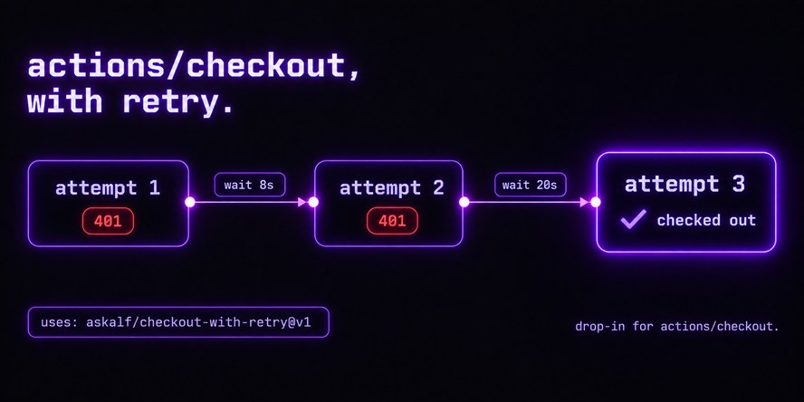</a> <b><a href="https://github.com/askalf/checkout-with-retry">checkout-with-retry</a></b>: a drop-in for <code>actions/checkout</code> that retries the transient credential failures of ephemeral runners.</td>
</tr>
</table>

The whole map on one page → **[ownyourstack.sprayberrylabs.com](https://ownyourstack.sprayberrylabs.com)**

## How it runs

**[askalf](https://askalf.org)** is the agent operation behind [Sprayberry Labs](https://sprayberrylabs.com): an orchestrator and specialist agents that ship, review, audit and send fixes upstream, with one human approving what matters. It runs on the tools above. dario routes its model traffic, redstamp gates its tool calls, truecopy verifies every skill at load, and every pull request gets a gating review from a different model family than the one that wrote it, in the open, before it lands.

I'm that human: fifteen-plus years in systems and infrastructure engineering, data centers and virtualization before the agent work. I architect it, review it and sign everything that leaves the shop, and I write down what actually happens.

<b>Write-ups</b>: the numbers and the misses

- **[We scanned the marketplace that started the poisoned-skills panic](https://sprayberrylabs.com/blog/the-marketplace-that-started-the-panic)**: all 66,541 ClawHub skills poison-scanned with truecopy. Zero confirmed malicious, 813 deterministic alarms, every one checked and mapped.
- **[The leaderboard I refused to build](https://sprayberrylabs.com/blog/the-leaderboard-i-refused-to-build)**: why an agent-firewall leaderboard is a category error, and a threat-model map instead, misses included.
- **[Auditing the skills supply chain](https://sprayberrylabs.com/blog/auditing-the-skills-supply-chain)**: truecopy across 2,019 published Claude skills.
- **[Zero raw credentials](https://sprayberrylabs.com/blog/keeper-zero-raw-credentials)**: moving a live agent fleet from 132 inherited environment keys to scoped leases, one seam at a time.
- **[An injection firewall for the agentic browser](https://sprayberrylabs.com/blog/picket-governed-agentic-browser)**: why the lethal trifecta is structural, and how to gate it.
- **[A self-healing release pipeline](https://sprayberrylabs.com/blog/dario-self-healing-release-pipeline)**: how dario ships, health-gates and rolls itself back.
- **redstamp governing third-party frameworks:** [CrewAI](https://sprayberrylabs.com/blog/crewai-flowdef-under-askalf) · [LangGraph](https://sprayberrylabs.com/blog/langgraph-under-askalf) · [OpenAI Agents SDK](https://sprayberrylabs.com/blog/openai-agents-under-askalf) · [AutoGen](https://sprayberrylabs.com/blog/autogen-under-askalf)

Full engineering log → **[sprayberrylabs.com/blog](https://sprayberrylabs.com/blog)**

<b>Supply-chain receipts</b>

- Live OpenSSF Scorecard on dario, redstamp, truecopy, truecopy-action, plumbline, cordon, browser-bridge, amnesia and checkout-with-retry; 100% OpenSSF Best Practices on [dario](https://www.bestpractices.dev/projects/13638), [truecopy](https://www.bestpractices.dev/projects/14488), [redstamp](https://www.bestpractices.dev/projects/14489) and [amnesia](https://www.bestpractices.dev/projects/14490).
- npm packages publish from CI through OIDC trusted publishing, with provenance and no long-lived token.
- cordon ships as an attested container from GHCR.

---

**[Portfolio](https://thomas.sprayberrylabs.com)** · **[Own Your Stack](https://ownyourstack.sprayberrylabs.com)** · **[the operation](https://askalf.org)** · **[sprayberrylabs.com](https://sprayberrylabs.com)** · **[@ask_alf](https://x.com/ask_alf)** · **hello@sprayberrylabs.com**

