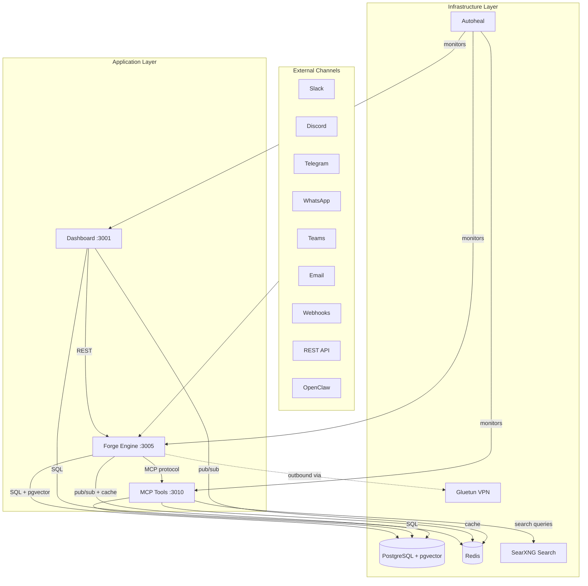
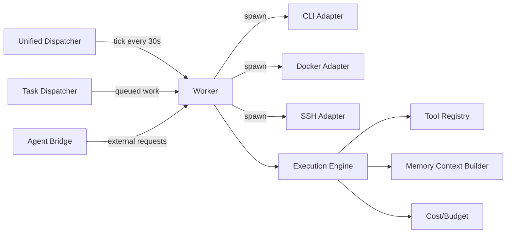
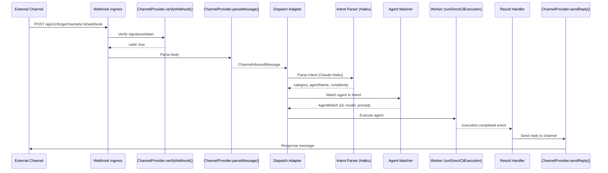
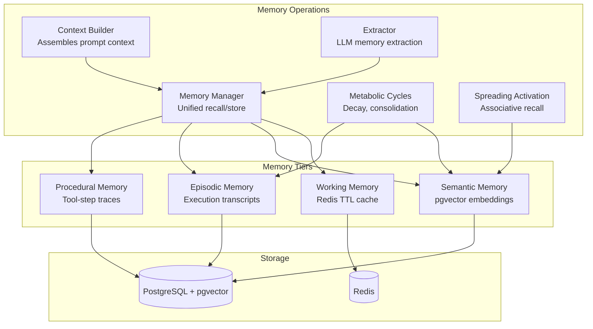
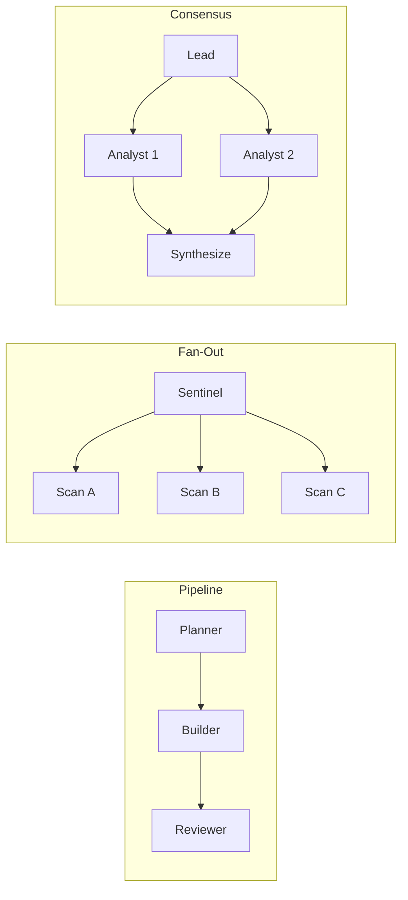

# AskAlf -- System Architecture

> Comprehensive technical reference for the AskAlf autonomous multi-agent fleet platform.

---

## 1. System Overview

AskAlf is an autonomous multi-agent fleet platform that orchestrates AI agents capable of designing, building, testing, deploying, and evolving software systems. It is a self-hosted, monorepo-based system built on Node.js/TypeScript with PostgreSQL (pgvector), Redis, and Docker.

**Key differentiators:**

- **Autonomous CI/CD pipeline** -- The Autonomy Loop detects branches, assigns reviews, auto-merges approved changes, deploys, and verifies health. Safety rails limit auto-deploys to 2/hour with blocked-path enforcement for critical files.
- **16-channel integration layer** -- A single `ChannelProvider` interface supports API, webhooks, Slack, Discord, Telegram, WhatsApp, Teams, Zapier, n8n, Make, email, Twilio SMS, SendGrid, Twilio Voice, Zoom, and OpenClaw. New channels require only one file implementing four methods.
- **4-tier memory architecture** -- Working (Redis TTL), semantic (pgvector embeddings), episodic (execution transcripts), and procedural (tool-step traces) memory with a Spreading Activation Network for associative recall.
- **Knowledge graph** -- Entity-relationship graph built automatically from agent executions, stored in pgvector for semantic node search.
- **Fleet coordination** -- Pipeline, fan-out, and consensus patterns for multi-agent task decomposition with DAG dependency tracking.
- **MCP protocol native** -- Tool server exposes all capabilities via the Model Context Protocol (SSE + Streamable HTTP transports).
- **Self-hosted first** -- Single `docker compose up` deployment with VPN tunneling, auto-healing containers, and credential encryption.

---

## 2. Monorepo Structure

The repository is a pnpm workspace with two top-level directories:

```
substrate/
  apps/
    forge/           -- Orchestration engine (Fastify, port 3005)
    dashboard/       -- Web UI (port 3001)
    mcp-tools/       -- Unified MCP tool server (Express, port 3010)
    admin-console/   -- Platform administration console
  packages/
    core/            -- Shared types, constants, utilities
    db/              -- Database client (pools, queries, audit helpers)
    auth/            -- Authentication and JWT handling
    observability/   -- Prometheus metrics, structured logging
    email/           -- Email transport (SMTP, templates)
    database/        -- Schema migrations (initdb scripts)
    agent-cli/       -- CLI client for agent interactions
  infrastructure/
    postgres/        -- PostgreSQL configuration
    redis/           -- Redis configuration
    searxng/         -- SearXNG search engine settings
  docs/              -- Architecture, API, and security documentation
```

Workspace definition (`pnpm-workspace.yaml`):

```yaml
packages:
  - 'packages/*'
  - 'apps/*'
```

---

## 3. Service Architecture



### Service Ports and Roles

| Service | Port | Role |
|---------|------|------|
| **Forge** | 3005 (internal) | Orchestration engine, agent runtime, channel dispatch, autonomy loop |
| **Dashboard** | 3001 (exposed) | Web UI, session management, workspace file access, CLI proxying |
| **MCP Tools** | 3010 (localhost) | MCP protocol tool server for workflow, data, infra, forge, and agent tools |
| **PostgreSQL** | 5432 (internal) | Primary datastore with pgvector extension for embeddings |
| **Redis** | 6379 (internal) | Event bus pub/sub, working memory TTL cache, rate limiting, SearXNG cache |
| **SearXNG** | 8080 (internal) | Self-hosted meta-search (Google, Bing, DuckDuckGo, Wikipedia, GitHub, StackOverflow) |
| **Gluetun** | 8888 (internal) | VPN tunnel for outbound traffic (optional, `--profile vpn`) |
| **Autoheal** | -- | Monitors `autoheal-askalf` labeled containers, restarts on healthcheck failure |

---

## 4. Forge Engine

Forge is the platform brain. It is a Fastify application (`apps/forge/src/index.ts`) with the following subsystems:

### 4.1 Routes

All routes are registered under `/api/v1/forge/` (or legacy `/api/` paths):

| Route module | Path prefix | Purpose |
|---|---|---|
| `agents` | `/agents` | CRUD for agent definitions |
| `executions` | `/executions` | Execution lifecycle, logs, cancellation |
| `sessions` | `/sessions` | User conversation sessions |
| `workflows` | `/workflows` | DAG workflow definitions |
| `tools` | `/tools` | Tool registry management |
| `memory` | `/memory` | Memory tier CRUD and search |
| `providers` | `/providers` | AI provider configuration |
| `user-providers` | `/user-providers` | Per-user provider keys |
| `assistant` | `/assistant` | Chat assistant endpoint |
| `admin` | `/admin` | Admin operations |
| `proposals` | `/proposals` | Change proposals (review/merge) |
| `webhooks` | `/webhooks` | Webhook management |
| `git-review` | `/git-review` | Code review integration |
| `onboarding` | `/onboarding` | First-run setup |
| `integrations` | `/integrations` | GitHub/GitLab/Bitbucket OAuth |
| `platform-admin` | `/platform-admin` | Multi-tenant platform admin |
| `cli` | `/cli` | CLI proxy endpoints |
| `templates` | `/templates` | Agent templates |
| `intent` | `/intent` | Natural-language intent parsing |
| `conversations` | `/conversations` | Multi-turn conversations |
| `channels` | `/channels` | Channel config and webhook ingress |
| `user-budget` | `/user-budget` | Per-user cost budgets |
| `devices` | `/devices` | IoT device registry |
| `daemons` | `/daemons` | Background daemon management |
| `terminal` | `/terminal` | Terminal session proxy |
| `triggers` | `/triggers` | Event-driven trigger rules |
| `economy` | `/economy` | Token economy and credits |
| `errors` | `/errors` | Client error reporting |
| `api-keys` | `/api-keys` | API key management |
| `dispatch` | `/dispatch` | Dispatcher control |
| `fleet-analytics` | `/fleet-analytics` | Fleet-wide analytics |
| `marketplace` | `/marketplace` | Package marketplace |
| `oauth-flow` | `/oauth-flow` | OAuth flow handling |
| `public-intent` | `/public-intent` | Unauthenticated intent endpoint |
| `credentials-health` | `/credentials-health` | Provider credential checks |
| `csp-report` | `/csp-report` | Content Security Policy reporting |

### 4.2 Runtime

The runtime subsystem (`apps/forge/src/runtime/`) manages agent execution:



Key runtime files:

| File | Responsibility |
|---|---|
| `worker.ts` | Wires provider adapters, tool registry, and execution engine. Provides `runDirectCliExecution()` for CLI-based and `runExecution()` for SDK-based execution. |
| `unified-dispatcher.ts` | Single 30-second tick loop. Reads dispatch config from `forge_agents` table. Replaces older scheduler daemon and daemon manager. Kill-switchable via `DISPATCHER_ENABLED` env or `forge_dispatcher_config` DB table. |
| `engine.ts` | Core execution loop: prompt construction, provider call, tool execution, iteration control. |
| `budget.ts` | Calculates runtime budgets, estimates task complexity, suggests max turns. |
| `fleet-coordinator.ts` | Multi-agent coordination using pipeline, fan-out, and consensus patterns. |
| `task-dispatcher.ts` | Priority queue for reactive (event-driven) agent dispatches. |
| `agent-bridge.ts` | Redis-based bridge for external systems to trigger agent executions. |
| `state-machine.ts` | Execution state transitions (pending, running, completed, failed, cancelled). |
| `error-handler.ts` | Error classification and retry logic. |
| `credential-resolver.ts` | Resolves per-agent and per-user provider credentials. |
| `economy.ts` | Token economy management for agent cost tracking. |
| `trigger-engine.ts` | Event-condition-action trigger evaluation. |

#### Runtime Adapters

The adapter registry (`apps/forge/src/runtime/adapters/`) supports multiple execution targets:

- `cli-adapter.ts` -- CLI-based execution (primary path, Claude/Codex CLI)
- `docker-adapter.ts` -- Sandboxed Docker container execution
- `ssh-adapter.ts` -- Remote execution via SSH
- `browser-adapter.ts` -- Browser automation
- `desktop-adapter.ts` -- Desktop application control
- `k8s-adapter.ts` -- Kubernetes pod execution
- `vscode-adapter.ts` -- VS Code extension integration
- `mobile-adapter.ts` -- Mobile device integration
- `arduino-adapter.ts` -- Arduino/microcontroller
- `rpi-adapter.ts` -- Raspberry Pi
- `homeassistant-adapter.ts` -- Home Assistant IoT

### 4.3 Orchestration

The orchestration layer (`apps/forge/src/orchestration/`) coordinates agent fleet behavior:

| File | Purpose |
|---|---|
| `event-bus.ts` | Redis pub/sub + in-memory EventEmitter. Channels: `forge:events:{type}` for lifecycle, `forge:agent:{id}:messages` for messaging. Event types: `ExecutionEvent`, `CoordinationEvent`. |
| `autonomy-loop.ts` | CI/CD automation: branch detection, review assignment, approval, merge, deployment, health verification. Max 2 auto-deploys/hour. Blocked paths: `autonomy-loop.ts`, `scheduling.ts`, `index.ts`, `migrations/`, `.env`, `docker-compose`. |
| `knowledge-graph.ts` | Entity-relationship graph from agent executions. Nodes are concepts/entities, edges are relationships. Uses pgvector for semantic search on nodes. |
| `capability-registry.ts` | Tracks what each agent can do based on historical execution data. |
| `checkpoint.ts` | Human-in-the-loop approval gates for high-risk operations. |
| `scheduler.ts` | Cron-like scheduling for recurring agent executions. |
| `monitoring-agent.ts` | Fleet health monitoring and alerting. |
| `event-log.ts` | Persistent event audit trail. |
| `reactive-triggers.ts` | Event-driven trigger evaluation (e.g., "when file changes, run agent"). |
| `dag.ts` | Directed acyclic graph execution for workflow steps. |
| `parallel.ts` | Parallel execution of independent workflow branches. |
| `task-decomposer.ts` | LLM-powered decomposition of complex tasks into subtasks. |
| `nl-orchestrator.ts` | Natural-language orchestration commands. |
| `replanner.ts` | Dynamic replanning when execution deviates from the original plan. |
| `router.ts` | Routes incoming requests to the appropriate agent. |
| `agent-matcher.ts` | Selects the best agent for a given task based on capabilities. |
| `cost-router.ts` | Routes to the cheapest capable provider/model combination. |
| `communication.ts` | Inter-agent messaging via Redis. |
| `shared-context.ts` | Shared execution context accessible by all agents in a coordination plan. |
| `goal-proposer.ts` | Autonomous goal generation based on system state. |
| `evolution.ts` | Self-improvement: agents propose and test enhancements to themselves. |

---

## 5. Channel System

The channel system connects external platforms to the Forge execution engine through a uniform interface.

### 5.1 ChannelProvider Interface

Every channel provider implements this interface (`apps/forge/src/channels/types.ts`):

```typescript
interface ChannelProvider {
  type: ChannelType;
  verifyWebhook(headers, body, config): ChannelVerifyResult;
  parseMessage(body): ChannelInboundMessage | null;
  sendReply(config, message): Promise<void>;
  handleChallenge?(headers, body, config): ChannelVerifyResult | null;
}
```

### 5.2 Supported Channels (16)

| Channel | File | Transport |
|---------|------|-----------|
| API | (direct route) | REST |
| Webhooks | `webhooks.ts` | HTTP POST |
| Slack | `slack.ts` | Events API |
| Discord | `discord.ts` | Gateway/Webhooks |
| Telegram | `telegram.ts` | Bot API webhooks |
| WhatsApp | `whatsapp.ts` | Cloud API webhooks |
| Teams | `teams.ts` | Bot Framework |
| Zapier | `automation.ts` | Webhook triggers |
| n8n | `automation.ts` | Webhook triggers |
| Make | `automation.ts` | Webhook triggers |
| Email | `email-channel.ts` | SMTP/IMAP |
| Twilio SMS | `twilio-sms.ts` | Twilio webhooks |
| SendGrid | `sendgrid-channel.ts` | Inbound Parse |
| Twilio Voice | `twilio-voice.ts` | TwiML |
| Zoom | `zoom-channel.ts` | Zoom webhooks |
| OpenClaw | `openclaw.ts` | Gateway bridge |

### 5.3 Dispatch Flow



### 5.4 Supporting Modules

- **`dispatch-adapter.ts`** -- Shared dispatch pipeline: inbound message to intent parse to agent match to execute.
- **`result-handler.ts`** -- Subscribes to `execution.completed` and `execution.failed` events on the event bus, then routes results back to the originating channel via the provider's `sendReply()`.
- **`crypto.ts`** -- AES-256-GCM encryption/decryption for stored channel credentials (bot tokens, API keys). Uses `CHANNEL_ENCRYPTION_KEY` env var (32-byte hex).
- **`webhook-delivery.ts`** -- Outbound webhook delivery with retry logic.
- **`openclaw-manager.ts`** -- Manages OpenClaw gateway connection lifecycle.

---

## 6. MCP Tool System

The MCP Tools server (`apps/mcp-tools/src/server.ts`) exposes all agent tools via the Model Context Protocol. It runs on port 3010 and supports both SSE and Streamable HTTP transports.

### 6.1 Tool Categories

Tools are organized into five handler modules:

#### Workflow Tools (`workflow.ts`)
| Tool | Description |
|------|-------------|
| `ticket_ops` | Create, update, assign, list, and audit work tickets |
| `finding_ops` | Manage findings (issues, vulnerabilities, insights) |
| `intervention_ops` | Human intervention request management |
| `agent_call` | Invoke another agent via the Forge API |

#### Data Tools (`data.ts`)
| Tool | Description |
|------|-------------|
| `db_query` | Run read queries against the Forge database (max 100 rows) |
| `substrate_db_query` | Query the Substrate (platform) database |
| `memory_search` | Vector similarity search across semantic memories |
| `memory_store` | Store new memories with embeddings |

#### Infrastructure Tools (`infra.ts`)
| Tool | Description |
|------|-------------|
| `docker_api` | Docker container management (list, inspect, logs, restart) |
| `deploy_ops` | Deployment operations (build, deploy, rollback) |
| `security_scan` | Security scanning of code and dependencies |
| `code_analysis` | Static code analysis and metrics |

#### Forge Intelligence Tools (`forge-tools.ts`)
| Tool | Description |
|------|-------------|
| `forge_checkpoints` | Human-in-the-loop checkpoint management |
| `forge_capabilities` | Agent capability registry queries |
| `forge_knowledge_graph` | Knowledge graph CRUD and traversal |
| `forge_goals` | Goal management (propose, track, complete) |
| `forge_fleet_intel` | Fleet-wide intelligence and analytics |
| `forge_memory` | Advanced memory operations |
| `forge_cost` | Cost tracking and optimization |
| `forge_coordination` | Multi-agent coordination plan management |

#### Agent Tools (`agent-tools.ts`)
| Tool | Description |
|------|-------------|
| `web_search` | SearXNG meta-search (no API keys required) |
| `web_browse` | Fetch URL and extract text content |
| `team_coordinate` | Multi-agent team coordination via Forge API |

#### Memory API Tools (`memory-api.ts`)

In addition to the MCP-registered tools, the memory API exposes advanced cognitive operations:

- `extract` -- LLM-powered memory extraction from conversation transcripts
- `seed` -- Bulk memory seeding from transcript files
- `consolidate` -- Merge duplicates, decay stale memories, reinforce confirmed
- `boot-kernel` -- Cognitive OS kernel for session bootstrap
- `handoff` -- Session handoff store/retrieve
- `backfill` -- Generate embeddings for unembedded memories
- `tool-outcome` -- Record tool execution outcomes for procedural memory
- `self-reflect` -- Agent self-reflection and meta-cognitive analysis
- `dream-cycle` -- Offline memory consolidation (inspired by sleep consolidation)
- `curiosity-explore` -- Autonomous curiosity-driven exploration
- `knowledge-map` -- Visualize knowledge graph neighborhoods
- `neuroplasticity` -- Adaptive memory strengthening/pruning

### 6.2 Security

All MCP endpoints are protected by `INTERNAL_API_SECRET`. Requests must include either:
- `Authorization: Bearer <secret>` header, or
- HMAC signature verification

### 6.3 Built-in Forge Tools

Forge also embeds tools directly in the worker runtime (`apps/forge/src/tools/built-in/`). These are available to agents without going through the MCP server:

`checkpoint-ops`, `code-analysis`, `code-exec`, `context-ops`, `cost-optimize`, `db-query`, `deploy-ops`, `docker-api`, `economy-ops`, `event-query`, `evolution-test`, `feedback-ops`, `file-ops`, `finding-ops`, `fleet-health`, `git-ops`, `goal-ops`, `intervention-ops`, `knowledge-graph-ops`, `knowledge-search`, `memory-search`, `memory-store`, `messaging`, `orchestrate`, `proposal-ops`, `security-scan`, `self-heal`, `self-improve`, `shell-exec`, `substrate-db-query`, `team-ops`, `ticket-ops`, `web-browse`, `web-search`, `workflow-ops`

---

## 7. Memory Architecture

The memory system (`apps/forge/src/memory/`) implements a biologically-inspired 4-tier architecture.



### 7.1 Tier Details

| Tier | Storage | Description |
|------|---------|-------------|
| **Working** | Redis with TTL | Short-lived per-execution context. Automatically expires. Configurable TTL per agent. |
| **Semantic** | pgvector (`forge_semantic_memories`) | Long-term factual knowledge. Stored with embeddings (OpenAI ada-002). Retrieved via cosine similarity with configurable `k` and `minSimilarity` thresholds. |
| **Episodic** | PostgreSQL (`forge_episodic_memories`) | Execution transcripts and outcomes. Records what happened, what worked, what failed. |
| **Procedural** | PostgreSQL (`forge_procedural_memories`) | Tool-step traces. Records sequences of tool calls that achieved specific outcomes, enabling agents to replay successful strategies. |

### 7.2 Memory Manager

The `MemoryManager` (`apps/forge/src/memory/manager.ts`) provides a unified interface:

- `recall(query, tiers?)` -- Searches across enabled tiers and returns ranked results
- `store(data, tier)` -- Routes data to the appropriate tier

Each agent has a `memory_config` JSONB field that independently enables/disables each tier with tier-specific settings.

### 7.3 Spreading Activation Network

The memory API implements a computational neuroscience model for associative recall:

- Each memory has an activation level (0.0--1.0)
- Accessing a memory "fires" it (activation = 1.0)
- Activation spreads to semantically similar memories via embedding proximity
- Activation decays exponentially over time
- Memories exceeding an activation threshold become "primed" and are loaded into context
- Lateral inhibition: highly active memories suppress competitors in the same category
- This creates emergent "trains of thought" -- one memory cascading to unexpected connections

### 7.4 Knowledge Graph

The knowledge graph (`apps/forge/src/orchestration/knowledge-graph.ts`) is an entity-relationship graph built automatically from agent executions:

- **Nodes**: Concepts, entities, and objects with `label`, `entity_type`, `description`, `properties`, and `mention_count`
- **Edges**: Relationships between nodes with `relation`, `weight`, and `properties`
- Uses pgvector for semantic node search via `generateEmbedding()`
- Supports traversal, neighborhood queries, and subgraph extraction

### 7.5 Metabolic Cycles

The metabolic system (`apps/forge/src/memory/metabolic.ts`) runs background maintenance:

- **Decay**: Reduces activation of unused memories over time
- **Consolidation**: Merges duplicate or near-duplicate memories (similarity > 0.92)
- **Reinforcement**: Strengthens memories that are frequently accessed or confirmed correct

---

## 8. Agent Fleet

### 8.1 Fleet Coordination Patterns

The fleet coordinator (`apps/forge/src/runtime/fleet-coordinator.ts`) supports three coordination patterns:



- **Pipeline**: Sequential handoff (e.g., Planner designs, Builder implements, Reviewer verifies)
- **Fan-out**: Parallel dispatch (e.g., Sentinel runs multiple security scans concurrently)
- **Consensus**: Multiple agents analyze independently, lead synthesizes results

### 8.2 Coordination Plans

Each coordination plan has:
- A lead agent that decomposes the task
- Tasks with DAG dependencies (`dependencies: string[]`)
- Status tracking per task: `pending` | `running` | `completed` | `failed`
- Result synthesis by the lead agent

### 8.3 Dynamic Worker Roles

Workers are created dynamically based on the task. Alf matches requests to the best specialist — from a library of 109 templates across 16 categories, or creates a new one on demand. Example roles:

| Worker | Role |
|--------|------|
| **System Monitor** | Health monitoring, alerting, auto-remediation |
| **Security Scanner** | Vulnerability scanning, dependency audits, threat detection |
| **Builder** | Implementation, data operations, service logic |
| **Designer** | UI components, client-side logic, accessibility |
| **Ops Worker** | Deployment pipelines, infrastructure configuration |
| **Tester** | Test generation, regression testing, quality verification |
| **Content Writer** | Documentation, reports, and content generation |
| **Researcher** | Market analysis, competitor tracking, data gathering |
| **Analyst** | Data analysis, reporting, pattern detection |
| **Scheduler** | Task planning, reminders, routine management |

### 8.4 Unified Dispatcher

The unified dispatcher (`apps/forge/src/runtime/unified-dispatcher.ts`) is the single scheduling system:

- 30-second tick loop reads `forge_agents` table for dispatch-enabled agents
- Supports scheduled (cron-like) and reactive (event-driven) dispatch modes
- Kill switch: `DISPATCHER_ENABLED` env var + `forge_dispatcher_config` DB table
- Enforces per-agent cost budgets and execution timeouts
- Runs guardrail checks before each dispatch

---

## 9. Database

### 9.1 PostgreSQL with pgvector

The platform uses `pgvector/pgvector:0.8.1-pg17` for combined relational and vector storage:

- **Relational tables**: Agents, executions, sessions, tickets, proposals, channels, marketplace
- **Vector columns**: `embedding vector(1536)` on semantic memory tables for cosine similarity search
- **Connection**: Shared `askalf` database, `substrate` user

### 9.2 Migration Strategy

Migrations live in `apps/forge/migrations/` as numbered SQL files, run automatically at Forge startup via `runForgeMigrations()`:

| Migration | Purpose |
|-----------|---------|
| `001_forge_schema.sql` | Core tables: agents, executions, sessions |
| `002_memory_system.sql` | Semantic, episodic, procedural memory tables |
| `003_orchestration.sql` | Coordination plans, task queues, event log |
| `004_tools_mcp.sql` | Tool registry, MCP server configs |
| `004b_agent_hub_tables.sql` | Marketplace packages, ratings, installs |
| `004c_selfhosted_schema_fixes.sql` | Self-hosted deployment patches |
| `005_observability.sql` | Audit logs, cost tracking, metrics |
| `006_capabilities.sql` | Agent capability registry |
| `007_feedback.sql` | User feedback and ratings |
| `008_advanced_features.sql` | Workflows, triggers, integrations |
| `009_heartbeat_agent.sql` | Heartbeat agent configuration |
| `010_meta_agent.sql` | Meta-agent (self-improvement) tables |
| `011_coordination_tables.sql` | Fleet coordination plans and tasks |
| `012_event_log_agent_index.sql` | Performance indexes on event log |
| `013_consciousness.sql` | Agent self-model and reflection |
| `014_genesis_agent.sql` | Genesis (bootstrapping) agent |
| `015_fleet_agents.sql` | Fleet agent definitions and schedules |
| `016_change_proposals.sql` | Code change proposal workflow |
| `017_deployment_logs.sql` | Deployment history and rollback |
| `018_templates_and_conversations.sql` | Agent templates and conversation history |

Initial schema setup is also handled by `packages/database/src/migrations/` mounted into the PostgreSQL `docker-entrypoint-initdb.d/`.

---

## 10. Marketplace

The marketplace (`apps/forge/src/routes/marketplace.ts`) enables package discovery, installation, and publishing.

### 10.1 Package Types

Each marketplace package has:
- `slug`, `name`, `description`, `long_description`
- `package_type` -- the kind of installable resource (agent template, tool, workflow, etc.)
- `version` -- semver version string
- `install_config` -- JSONB configuration for automated installation
- `required_env_vars` -- environment variables the package needs
- `tags` -- searchable labels
- `status` -- `draft`, `published`, `archived`
- `is_verified`, `is_featured` -- editorial flags

### 10.2 Rating System

- Users rate packages 1--5 with optional text reviews
- `avg_rating` is computed and stored on the package row
- One rating per user per package (upsert behavior)

### 10.3 Install Flow

1. User browses/searches packages (`GET /api/v1/forge/marketplace/packages`)
2. User views package details (includes `install_config` and `required_env_vars`)
3. User installs package -- the `install_config` JSONB is applied to create the appropriate resource (agent, tool, workflow)
4. Installation is recorded in `marketplace_installs` with `installed_resource_id` and `installed_resource_type`

---

## 11. Security

### 11.1 Credential Encryption

Channel credentials (bot tokens, API keys, OAuth secrets) are encrypted at rest using AES-256-GCM (`apps/forge/src/channels/crypto.ts`):

- Algorithm: `aes-256-gcm`
- IV: 12 bytes, randomly generated per encryption
- Auth tag: 16 bytes
- Key: `CHANNEL_ENCRYPTION_KEY` env var (64-character hex = 32 bytes)
- Storage format: `base64(iv):base64(authTag):base64(ciphertext)`

### 11.2 Internal API Authentication

- `INTERNAL_API_SECRET` -- Bearer token or HMAC signature for service-to-service calls (Forge to MCP Tools, Dashboard to Forge)
- `JWT_SECRET` -- JWT signing for user sessions
- `SESSION_SECRET` -- Cookie session encryption
- `FORGE_API_KEY` -- API key for Forge REST API access

### 11.3 Docker Sandboxing

All containers in the compose stack are hardened:

- `read_only: true` -- Read-only root filesystems with explicit tmpfs mounts
- `no-new-privileges: true` -- Prevents privilege escalation
- `cap_drop: ALL` -- Drop all Linux capabilities, then selectively add only required ones
- Memory limits enforced via `deploy.resources.limits`
- CPU limits on Forge (2.0 cores max)
- Docker socket mounted read-only where needed

### 11.4 VPN Tunneling

Optional Gluetun VPN container (`--profile vpn`):

- Supports WireGuard and OpenVPN protocols
- Default provider: ProtonVPN (configurable)
- HTTP proxy on `:8888` for other containers to route outbound traffic
- DNS over TLS with malware blocking
- Server country selection via `VPN_SERVER_COUNTRIES`

### 11.5 Intervention Requests

High-risk operations trigger human-in-the-loop intervention:

- `intervention_ops` tool allows agents to request human approval
- `checkpoint.ts` orchestration module gates execution at defined points
- The autonomy loop enforces blocked paths that always require human review (migrations, core config files, the autonomy loop itself)
- Max 2 auto-deploys per hour rate limit

### 11.6 Network Isolation

- All services communicate on a private `askalf-net` bridge network
- Only the Dashboard port (3001) and MCP Tools localhost port (3010) are exposed
- PostgreSQL and Redis have no exposed ports

---

## 12. Development

### 12.1 Adding a New Channel Provider

1. Create a new file in `apps/forge/src/channels/` (e.g., `my-channel.ts`)
2. Implement the `ChannelProvider` interface:

```typescript
import type { ChannelProvider, ChannelConfig, ChannelInboundMessage,
  ChannelOutboundMessage, ChannelVerifyResult } from './types.js';

export const myChannelProvider: ChannelProvider = {
  type: 'my_channel' as any,  // Add to ChannelType union in types.ts

  verifyWebhook(headers, body, config): ChannelVerifyResult {
    // Verify inbound webhook signature
    return { valid: true };
  },

  parseMessage(body): ChannelInboundMessage | null {
    // Extract text, externalMessageId, externalChannelId, externalUserId
    return { text: body.message, externalMessageId: body.id };
  },

  async sendReply(config, message): Promise<void> {
    // Send response back to the channel's API
  },

  handleChallenge(headers, body, config): ChannelVerifyResult | null {
    // Handle platform verification challenges (optional)
    return null;
  },
};
```

3. Add the new type to the `ChannelType` union and `CHANNEL_TYPES` array in `apps/forge/src/channels/types.ts`
4. Register the provider in `apps/forge/src/channels/index.ts`

### 12.2 Adding a New MCP Tool

1. Choose the appropriate handler module in `apps/mcp-tools/src/`:
   - `workflow.ts` -- Task/ticket management tools
   - `data.ts` -- Database and memory tools
   - `infra.ts` -- Docker, deployment, and analysis tools
   - `agent-tools.ts` -- Web and coordination tools
   - `forge-tools.ts` -- Forge intelligence tools

2. Add the tool definition to the `TOOLS` array:

```typescript
{
  name: 'my_tool',
  description: 'What this tool does',
  inputSchema: {
    type: 'object' as const,
    properties: {
      action: { type: 'string', enum: ['list', 'get', 'create'] },
      id: { type: 'string', description: 'Resource ID' },
    },
    required: ['action'],
  },
}
```

3. Add the handler case in the corresponding `handleTool()` function:

```typescript
case 'my_tool': {
  const { action, id } = args;
  // Implementation
  return { content: [{ type: 'text', text: JSON.stringify(result) }] };
}
```

The tool will automatically appear in `ListTools` responses and be callable via the MCP protocol.

### 12.3 Adding a Marketplace Package

1. Insert a package row via the Forge API or directly into `marketplace_packages`:
   - Set `slug`, `name`, `description`, `package_type`, `version`
   - Define `install_config` JSONB with the configuration needed to instantiate the resource
   - List `required_env_vars` that the user must set
   - Add `tags` for discoverability
   - Set `status` to `published` when ready

2. The install flow will use `install_config` to create the target resource (agent, tool, workflow) in the user's tenant.

3. Users can rate and review installed packages, which updates `avg_rating` on the package row.
